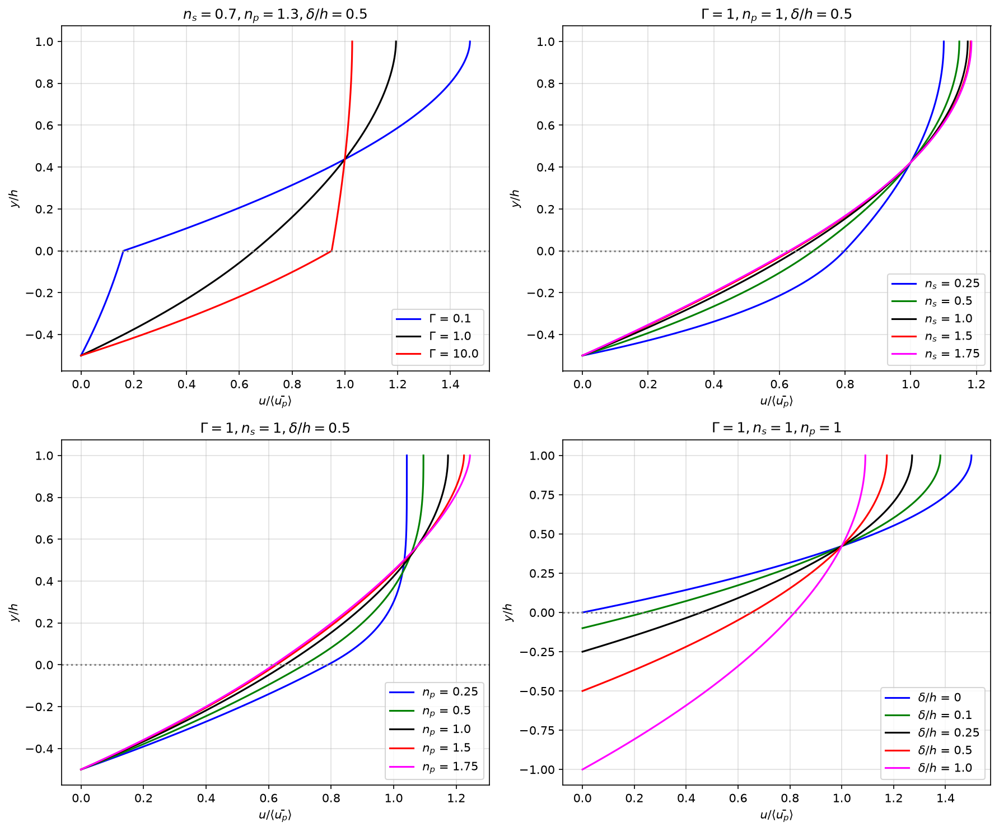
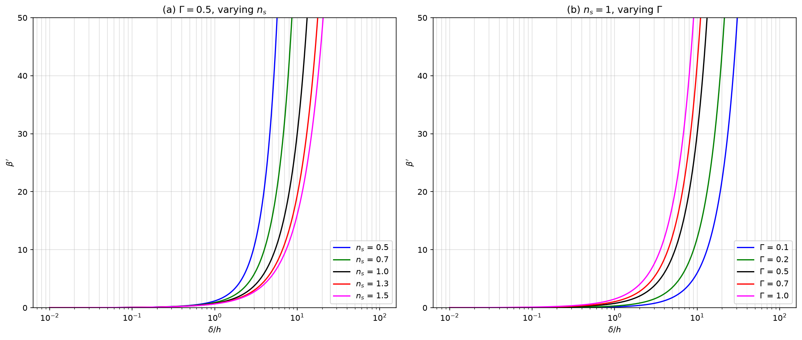
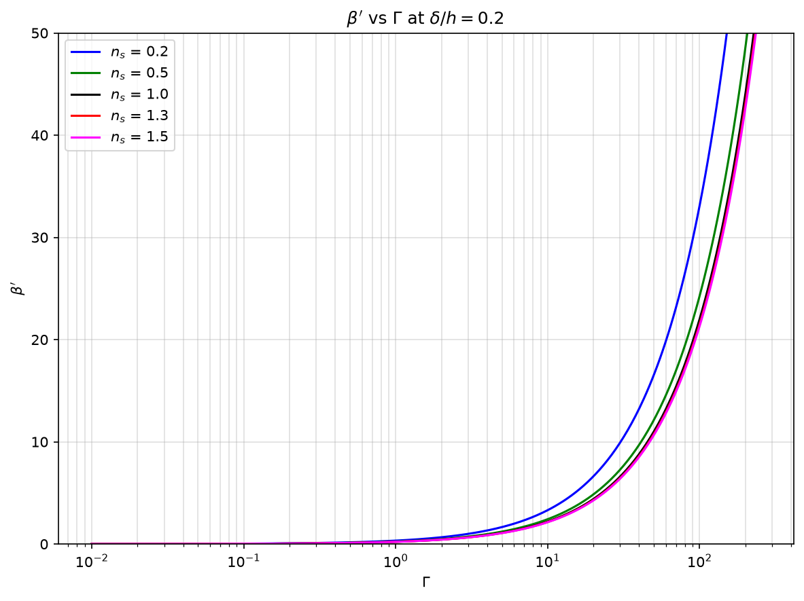
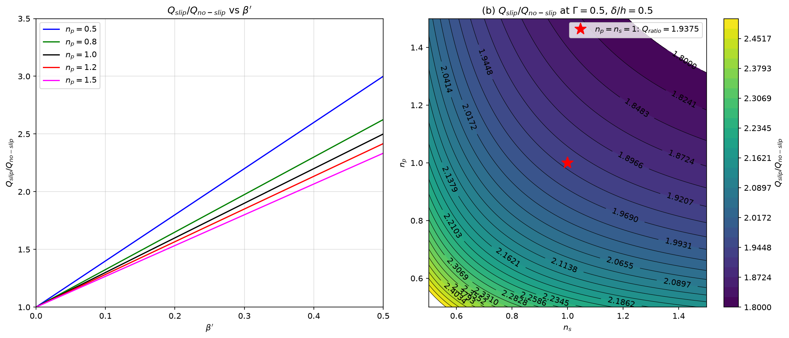
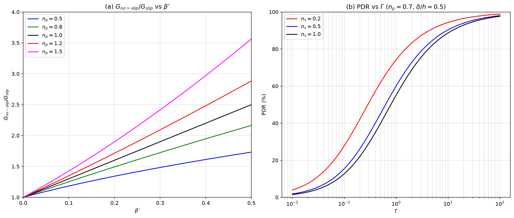
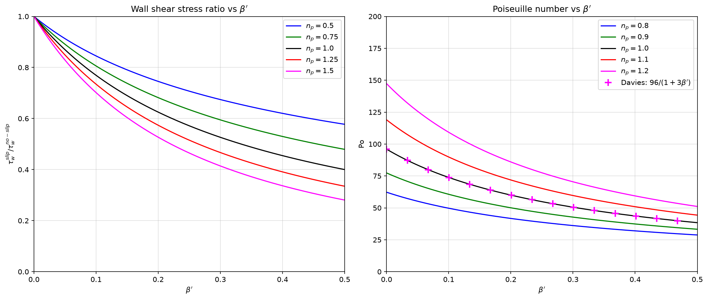

# Apparent Slip Model in Non-Newtonian Liquid-Infused Microchannels (NLIS)

Python reproductions of the figures in [Chandran et al (2026)](https://doi.org/10.1017/jfm.2026.11719) modeling two-layer flow dynamics over Non-Newtonian Liquid-Infused Surfaces (NLIS).

## Figures

### Figure 3: Velocity Profiles
Nondimensional velocity profiles $u/\langle \bar{u}_p \rangle$ across the primary and secondary fluid layers.

---

### Figure 4: Slip Length
Nondimensional slip length variations under different flow conditions.

---

### Figure 5: Apparent Slip Parameter ($\beta$) vs Viscosity Ratio ($\Gamma$)
Variation of slip length $\beta$ as a function of viscosity ratio $\Gamma$.

---

### Figure 6: Flow Rate Ratio
Variation of flow rate ratio $Q_{slip}/Q_{no-slip}$ with varying interface and layer parameters.

---

### Figure 7: Pressure Drop Reduction (PDR)
Pressure ratio and PDR characteristics with respect to slip length and viscosity ratio.

---

### Figure 8: Wall Shear Stress & Poiseuille Number
Variations of nondimensional wall shear stress and Poiseuille number ($Po$) with respect to slip length.

